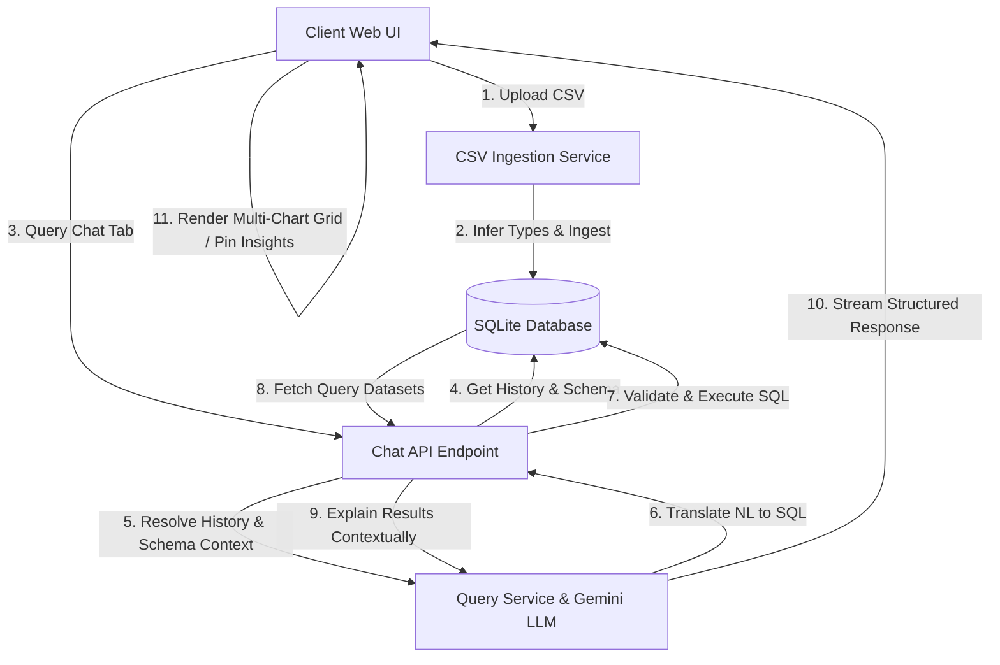
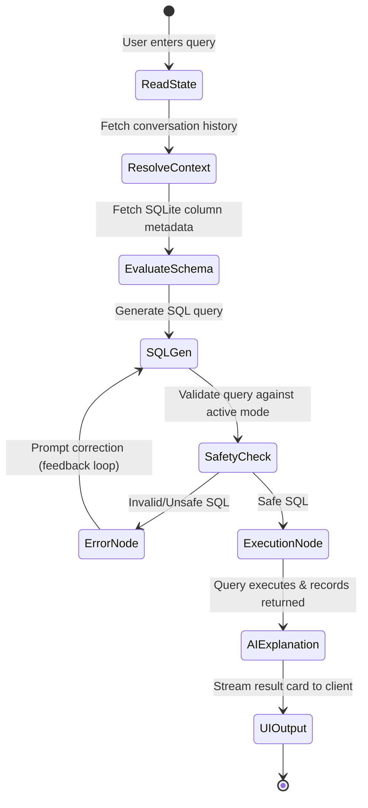

# StatChat — Data Analytics Platform Architecture & Design

StatChat is an AI-powered Business Intelligence (BI) and data analytics platform that allows users to ingest CSV datasets and explore them using natural language. It translates human questions into optimized SQL queries, executes them against local databases, and automatically presents the results as interactive visualizations and rich text explanations.

---

## 1. System Architecture & Component Mapping

The application follows a clean, decoupled architecture consisting of a FastAPI backend, a relational database layer, and a vanilla glassmorphic frontend.



### Backend Layer (FastAPI & Python)
* **`app/main.py`**: Entrypoint initializing routes, CORS headers, and mounting the static UI assets.
* **`app/api/endpoints/upload.py`**: Handles CSV uploads, dataset deletions, chat session instantiation, and the streaming chat analytical execution loops.
* **`app/database/`**: Configures SQLite database engines, defines SQLAlchemy relational models (`ChatMessage`, `ChatSession`), and handles database transaction lifecycles.

### Service Layer (Business Logic)
* **`app/services/csv_service.py`**: Ingests uploaded raw files. Uses Pandas chunking to read large files, dynamically infers data types (e.g. converting float, string, and integer values), maps them to SQLite columns, and loads data into a dynamically created SQL table.
* **`app/services/query_service.py`**: Core AI orchestration. Manages the system prompting, structures schemas, enforces safety checks on mutations, calls the Google Gemini API (`gemini-3.1-flash-lite`), parses JSON multi-query arrays, and commands SQL executions.

### Frontend Layer (Responsive UI)
* **`app/static/index.html`**: Structured single-page application (SPA) containing the Recruiter overview landing screen, a glassmorphic sidebar, and the dual-pane Workspace (Dashboard Tab & SQL Chat Tab).
* **`app/static/styles.css`**: Design system tokens utilizing custom dark mode colors, glossy backdrops (`backdrop-filter`), smooth card transitions, and responsive flexboxes.
* **`app/static/app.js`**: Client-side state manager. Listens to file uploads, maintains chat logs, processes query outputs, routes datasets to ApexCharts adapters, and handles client-side thumbtack pinning caches.

---

## 2. In-Depth Feature Execution Flows

### A. CSV Data Ingestion & Table Creation
1. The user drops a CSV file into the drop-zone. The frontend sends it via `multipart/form-data` to `/upload`.
2. `csv_service.py` sanitizes the file name (creating a clean SQL table name, e.g. `student_dataset`).
3. The data types are evaluated. If a column contains only integers, it maps to `BIGINT`. If it contains floats, it maps to `FLOAT`. Otherwise, it falls back to `TEXT`.
4. A dynamic table is created, the rows are inserted in bulk batches, and a SQLite overview profile (row count, categorical value distribution, numerical averages) is compiled.

```text
[User File Drop]
       │ (1. Raw CSV file payload via multipart/form-data POST to /upload)
       ▼
[upload.py (FastAPI Endpoint)] ──► [csv_service.py (Pandas Ingestion)]
                                         │
                                         │ (2. Scan types: e.g. Column "math" = Ints only -> BIGINT, "name" -> TEXT)
                                         ▼
                                  [SQLAlchemy Metadata Engine]
                                         │
                                         │ (3. Execute CREATE TABLE student_dataset)
                                         ▼
                                  [SQLite DB File (analytics_db.db)] 
                                         │
                                         │ (4. Bulk insert rows in chunks)
                                         ▼
                                  [Data profiling PRAGMAs run] ──► Return row count/averages profile to Client UI
```

### B. Natural Language to SQL Generation Loop
1. The user types a query (e.g., *"What is the average test score by gender?"*).
2. The endpoint `/chat` fetches the chat history for the active session from the `ChatMessage` table to resolve pronoun references.
3. The system pulls the target table's active schema using:
   ```sql
   PRAGMA table_info(student_dataset);
   ```
4. A prompt is compiled for the Gemini model, containing:
   * The exact list of columns and types.
   * A sample of rows.
   * Resolved conversation history.
   * Safety directives (e.g. read-only constraints in Analysis mode, database dialect rules).
5. Gemini generates the optimized SQL query.
6. The query is validated locally. If the mode is "Analysis Mode" and contains modification keywords (`INSERT`, `UPDATE`, `DROP`), execution is aborted. If it is "Data Cleaning Mode", a table backup clone (`backup_student_dataset`) is created before the mutations run.
7. The query is executed against the database. The matching records are retrieved as JSON arrays.
8. The question, generated SQL, and raw output records are sent back to Gemini to produce a human-readable summarization explaining the trends.

```text
[User Chat Submission]
       │ (1. Question + session_id POST to /chat)
       ▼
[upload.py (FastAPI Endpoint)]
       │
       │ (2. Load chat history list & execute PRAGMA table_info columns)
       ▼
[query_service.py (Gemini LLM Prompt Compilation)]
       │
       │ (3. System Prompt compiles context resources)
       ▼
[Google Gemini Model (Translation Node)]
       │
       │ (4. Yields structured SQL statement)
       ▼
[SQL Safety Validator Node]
       │
       │ (5. Validates modification safety constraints)
       ▼
[SQLite Local Database Execution]
       │
       │ (6. Executes statement and fetches query records)
       ▼
[query_service.py (Insight Synthesis Node)]
       │
       │ (7. Gemini compiles textual explanation summary from raw records)
       ▼
[Client Web UI (Visualization Adapters)] ──► Renders interactive ApexCharts + updates custom Pinned dashboard
```

### C. Conversational Memory Mechanism
To allow natural follow-up questions, the context is preserved across conversational turns:
* Past user messages and AI responses are fetched chronologically.
* They are concatenated into a standard format inside the system prompt:
  ```text
  [CONVERSATION HISTORY]
  User: Show the top 5 students by math grade.
  AI: (Generated SQL: SELECT name, math_grade FROM student_dataset ORDER BY math_grade DESC LIMIT 5)
  ...
  ```
* This lets the AI resolve follow-ups like *"Which of those are from Los Angeles?"* by reading the previous output table metadata and adding a `WHERE city = 'Los Angeles'` filter.

---

## 3. LangGraph & Model Context Protocol (MCP) Design Integration

While the application operates with lightweight local scripts for simplicity and performance, its architecture is designed around the core patterns of **Model Context Protocol (MCP)** and **LangGraph**:

### A. Model Context Protocol (MCP) Implementation Pattern
The Model Context Protocol (MCP) standardizes how AI applications safely interface with local client tools and data contexts. StatChat implements this design pattern in two ways:
1. **Schema Ingestion as a Context Resource:** The database schemas are not hardcoded. When the user selects a dataset, the application dynamically interrogates the SQLite system tables to extract active columns, shapes, and constraints. This schema acts as an MCP **Resource**, fed directly to the model as context.
2. **SQL Execution as an AI Tool Call:** The SQL generator acts as an MCP **Tool**. Rather than allowing the LLM to write code freely, it is constrained to output structured database commands. The backend acts as the MCP Host, intercepting the tool call, validating syntax constraints, executing the operations in a sandboxed local transaction, and feeding the result context back to the model.

### B. LangGraph Design Loop
LangGraph is a library designed to build agentic workflows using state charts. StatChat's SQL generation pipeline represents a **State Graph loop** that handles decision routing:



1. **ResolveContext State:** Resolves active memory states from past messages.
2. **EvaluateSchema State:** Loads column definitions.
3. **SQLGen State:** Gemini translates the natural language query.
4. **SafetyCheck / Validation Node:** Intercepts the generated SQL. If an error or mutation violation is detected, it loops back to the SQLGen state with the error trace for auto-correction, or routes to an error node.
5. **Execution Node:** Commits the transactions or fetches rows from the SQLite engine.
6. **Insight Node:** Summarizes findings and updates the chat history state.

---

## 4. Multi-Query Dashboards & Advanced Visualization Engine

StatChat supports interactive BI dashboards in the UI:
1. **Multi-Query Dashboards:** When a user asks a broad overview question, the AI generates a structured JSON payload consisting of multiple sub-queries:
   ```json
   [
     { "title": "Averages by Subject", "sql": "SELECT avg(math)...", "chart_type": "bar" },
     { "title": "Data Distribution", "sql": "SELECT gender, count(*)...", "chart_type": "donut" }
   ]
   ```
2. The UI processes this array, dynamically creates a CSS grid layout, runs each SQL sub-query, and creates individual visualization cards inside the grid.
3. **Advanced Charts:** Auto-detects chart intent based on keyword parsing:
   * **Donut Chart:** Categorical group counts.
   * **Bar Chart:** Averages, comparisons.
   * **Line Chart:** Sequential trends over time.
   * **Scatter Plot:** Correlation variables (`{ x, y }` coordinates).
   * **Heatmap:** Density mappings.
4. **Pin to Dashboard:** A thumbtack button allows saving any chat results into local storage, enabling users to construct persistent custom report layouts.
